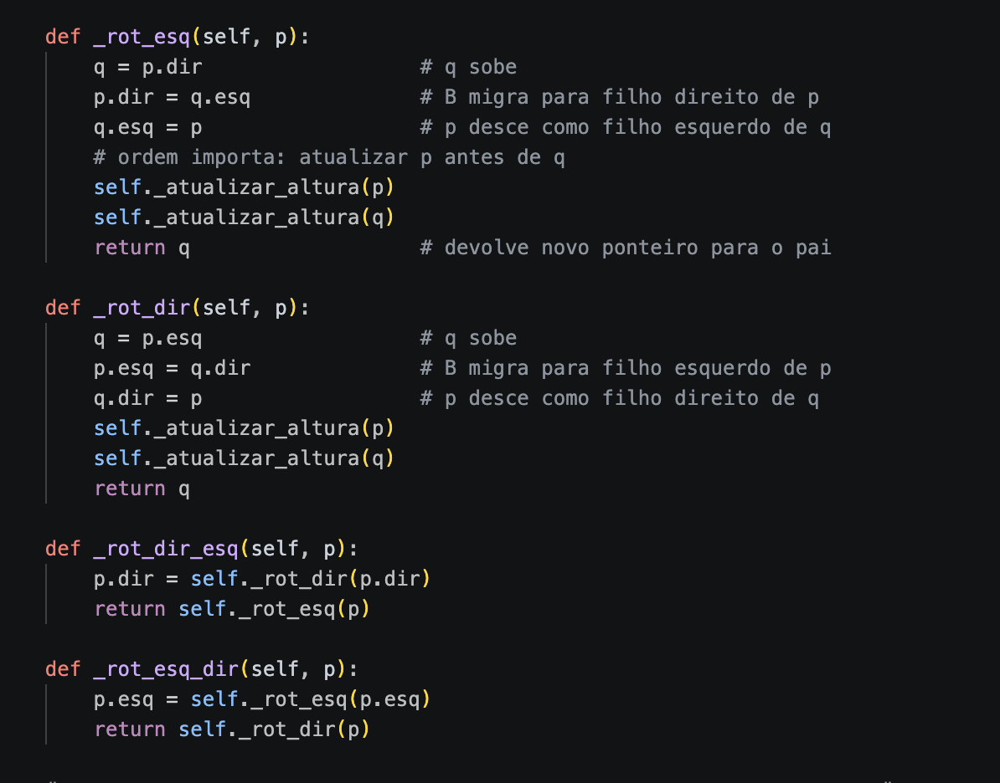
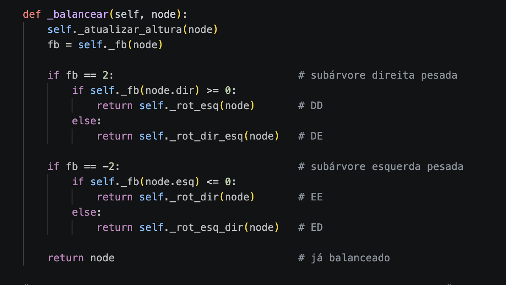

# Gerenciador de Contatos — BST vs AVL

Número da Lista: Trabalho 3<br>
Conteúdo da Disciplina: Árvores<br>


## Alunos
| Matrícula | Aluno |
| -- | -- |
| 231026385 | Igor Veras Daniel |
| 231026483 | Maria Eduarda de Amorim Galdino |


## Link do Vídeo 
[Assistir ao vídeo](https://www.youtube.com/watch?v=zu6h1HWkD-Q)

## Sobre

Gerenciador de contatos em linha de comando que implementa e compara
duas estruturas de dados: uma **Árvore Binária de Busca simples (BST)**
e uma **Árvore AVL (balanceada)**. Ambas armazenam os mesmos contatos
(nome + telefone) e todas as operações — inserção, remoção e busca —
são executadas nas duas árvores simultaneamente.

O projeto possui um **modo benchmark** dedicado, que insere sequências
de contatos ordenadas e aleatórias nas duas estruturas, mede o tempo de
cada operação e exibe uma tabela comparativa com barras ASCII e as
árvores desenhadas lado a lado — tornando visível como o
rebalanceamento automático da AVL a mantém sempre mais compacta e
eficiente que a BST, especialmente no pior caso (inserção em ordem
alfabética, que degenera a BST numa lista encadeada).


## Screenshots

### Rotações AVL 


### Balanceamento AVL 



## Instalação

Linguagem: Python 3.10+<br>
Framework: Nenhum (apenas biblioteca padrão)<br>

```bash
git clone https://github.com/eda2-2026/G8_Arvore_EDA2-2026.1.git
cd app
python3 main.py
```


## Uso

Ao executar, o menu principal é exibido:

```
========================================
  GERENCIADOR DE CONTATOS — BST vs AVL
========================================

[1] Inserir contato
[2] Remover contato
[3] Buscar contato
[4] Listar em ordem
[5] Benchmark BST vs AVL
[6] Sair
```

As opções 1 a 4 funcionam como um gerenciador normal — após cada
inserção ou remoção as duas árvores são desenhadas em ASCII para
comparação visual imediata.

A opção **[5] Benchmark** é onde a diferença fica mais evidente.
Dois cenários são executados automaticamente:

```
==================================================
       BENCHMARK — BST vs AVL
==================================================

>>> CENÁRIO 1: Inserção em ordem alfabética (pior caso BST)

┌─────────────────────────────────────────┐
│  Inserção ordenada                      │
├──────────┬──────────────┬───────────────┤
│          │    BST       │      AVL      │
├──────────┼──────────────┼───────────────┤
│ Tempo    │ 0.000412s    │  0.000089s    │
│ Altura   │ 9            │  3            │
│ Gráfico  │ ████████████ │  ███          │
└──────────┴──────────────┴───────────────┘

>>> CENÁRIO 2: Inserção em ordem aleatória (caso médio)
...
```

---

## Outros

Estrutura de arquivos:

```
avl-contatos/
├── main.py        # ponto de entrada
├── bst.py         # BST simples
├── avl.py         # AVL com rotações
├── interface.py   # menu e visualização ASCII
├── benchmark.py   # cenários de comparação BST vs AVL
└── README.md
```

A chave de ordenação é o **nome** do contato em ordem alfabética.
O benchmark usa listas fixas de 10 contatos para garantir
reprodutibilidade, mas pode ser facilmente expandido.